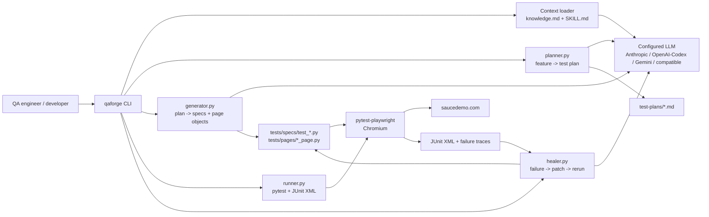

# QAForge

> AI-driven test automation framework. **Plan → Generate → Run → Heal.**

QAForge turns plain-English feature descriptions into runnable Playwright + Python tests, runs them, and auto-heals broken locators using your configured LLM.

> **Status:** alpha — all 4 MVP commands shipped (Week 6).
> Full setup walk-through: [GETTING-STARTED.md](GETTING-STARTED.md).

## What's in MVP

| Command | What it does |
|---|---|
| `qaforge plan "<feature>"` | Generates a Markdown test plan and asks for approval |
| `qaforge generate --plan <file>` | Generates `test_*.py` + page objects, py_compile-checks (1 retry), runs pytest once |
| `qaforge run [paths...]` | Runs pytest, parses JUnit XML, prints structured pass/fail summary, writes an HTML report |
| `qaforge heal [--auto] [--max-attempts N]` | Reads failures, asks the configured LLM for fixes, shows diff, re-runs |
| `qaforge init <dir>` | Scaffolds a new project (knowledge.md, skills/, tests/, CI workflow) |

Locked-in test tech: **Playwright + Python (pytest-playwright)**. LLM provider is configurable via `.env`. Default demo target app: **https://www.saucedemo.com**.

## System Design

QAForge is a local CLI-first workflow. The user drives it from the terminal, the configured LLM handles planning/code-healing decisions, and Playwright + pytest execute the generated browser tests.



### Core Components

| Component | Responsibility |
|---|---|
| `qaforge/cli.py` | Click command surface for `plan`, `generate`, `run`, `heal`, `init`, and diagnostics |
| `qaforge/context.py` | Builds the system prompt from `knowledge.md` plus selected `skills/*/SKILL.md` files |
| `qaforge/llm.py` | Provider router; validates the selected provider API key and returns text/token metadata |
| `qaforge/planner.py` | Converts plain-English feature descriptions into structured Markdown test plans |
| `qaforge/generator.py` | Converts approved plans into Playwright + Python specs and Page Objects, then compile-checks them |
| `qaforge/runner.py` | Runs pytest, parses JUnit XML, summarizes pass/fail state, and detects common environment issues |
| `qaforge/healer.py` | Sends failing test context to the configured LLM, validates returned patches, shows diffs, applies fixes, and reruns |
| `qaforge/initializer.py` | Scaffolds QAForge conventions into a new project |

### Runtime Flow

1. `qaforge plan "<feature>"` loads `knowledge.md` and `skills/test-design/SKILL.md`, asks the configured LLM for a Markdown test plan, then saves it under `test-plans/`.
2. `qaforge generate --plan <file>` loads `skills/write-test/SKILL.md`, sends the approved plan and existing Page Object list to the configured LLM, writes only allowed files under `tests/specs/` and `tests/pages/`, then runs `py_compile` and an optional first-run pytest check.
3. `qaforge run` executes pytest through `runner.py`, captures JUnit XML, prints a concise terminal summary, and writes `test-results/qaforge-report.html`.
4. `qaforge heal` sends the failing spec, imported Page Objects, and traceback to the configured LLM using `skills/heal-test/SKILL.md`; it validates the returned JSON patch, shows a diff unless `--auto` is used, applies the patch, and reruns.

### Design Constraints

- LLM provider is configurable through `QAFORGE_LLM_PROVIDER`.
- Generated code is limited to `tests/specs/` and `tests/pages/`.
- Playwright uses the synchronous Python API through `pytest-playwright`.
- Tests follow Page Object Model; specs should not contain raw selectors.
- Healing is intentionally narrow: locator drift, timing flakes, and small selector mistakes, not test intent rewrites.

## Quickstart

macOS / Linux:

```bash
python3 -m venv .venv && source .venv/bin/activate
pip install -e '.[test]'
playwright install chromium
cp .env.example .env  # then choose provider/model and add the matching API key

# Smoke checks
qaforge skills                                       # list available skills
qaforge context test-design                          # print resolved system prompt
qaforge ask "where do generated tests live?"        # configured LLM with project context
pytest -m smoke                                      # offline Playwright smoke

# Week 2 — generate a test plan
qaforge plan "User login with email and password"
qaforge plan --file ./requirements.txt
qaforge plan "Add product to cart" --auto            # skip approval prompt

# Week 3-4 — generate test code from a plan
qaforge generate --plan test-plans/001-user-login.md
qaforge generate --plan test-plans/001-user-login.md --no-run    # skip first-run check
qaforge generate --plan test-plans/001-user-login.md --no-retry  # don't retry compile failures
```

Windows PowerShell:

```powershell
.\scripts\setup-local.ps1
.\.venv\Scripts\Activate.ps1
```

You should see the configured LLM answer with **awareness of QAForge's folder structure** (i.e., it mentions `tests/specs/` and `tests/pages/`).

MVP comparison notes live in [docs/MVP-GAP-ANALYSIS.md](docs/MVP-GAP-ANALYSIS.md).
Local verification helper: `.\scripts\verify-local.ps1` for offline checks, or `.\scripts\verify-local.ps1 -Full` for browser-backed checks.

## LLM provider config

Choose the provider in `.env`. Codex/OpenAI is the default example:

```text
QAFORGE_LLM_PROVIDER=codex
QAFORGE_MODEL=gpt-5.2-codex
OPENAI_API_KEY=sk-...
```

Other supported values for `QAFORGE_LLM_PROVIDER` are `anthropic`, `openai`, `gemini`, and `openai-compatible`. OpenAI-compatible providers also require `OPENAI_BASE_URL`.

## Repo layout

```
qaforge/                              ← Python package (CLI + library)
│   ├── cli.py                        click CLI entry point
│   ├── llm.py                        configurable LLM client
│   ├── context.py                    loads knowledge + skills
│   ├── planner.py                    feature → test plan markdown
│   └── integration.py                week 1 smoke
│
├── knowledge.md                      AI global rules (project-wide)
├── skills/
│   ├── test-design/SKILL.md          how to plan tests
│   └── write-test/SKILL.md           how to write Playwright code
├── templates/
│   ├── spec_template.py              reference test for the LLM
│   └── page_template.py              reference POM for the LLM
├── tests/
│   ├── pages/                        generated POMs land here
│   └── specs/                        generated specs land here
├── test-plans/                       generated plans land here
├── conftest.py                       pytest config (baseURL, fixtures)
├── pyproject.toml                    deps + scripts
└── .github/workflows/test.yml        CI template (week 6)
```

## License

MIT
