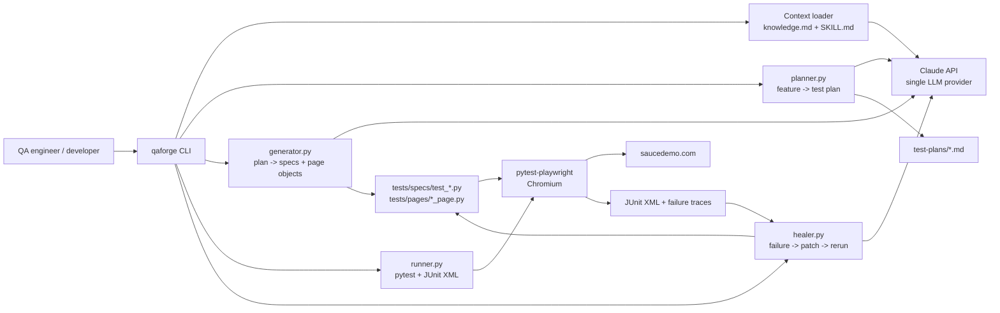

# QAForge

> AI-driven test automation framework. **Plan → Generate → Run → Heal.**

QAForge turns plain-English feature descriptions into runnable Playwright + Python tests, runs them, and auto-heals broken locators using Claude.

> **Status:** alpha — all 4 MVP commands shipped (Week 6).
> Full setup walk-through: [GETTING-STARTED.md](GETTING-STARTED.md).

## What's in MVP

| Command | What it does |
|---|---|
| `qaforge plan "<feature>"` | Generates a Markdown test plan and asks for approval |
| `qaforge generate --plan <file>` | Generates `test_*.py` + page objects, py_compile-checks (1 retry), runs pytest once |
| `qaforge run [paths...]` | Runs pytest, parses JUnit XML, prints structured pass/fail summary |
| `qaforge heal [--auto] [--max-attempts N]` | Reads failures, asks Claude for fixes, shows diff, re-runs |
| `qaforge init <dir>` | Scaffolds a new project (knowledge.md, skills/, tests/, CI workflow) |

Locked-in tech: **Playwright + Python (pytest-playwright)**, **Claude (Sonnet 4.6)**, target app **https://www.saucedemo.com**.

## System Design

QAForge is a local CLI-first workflow. The user drives it from the terminal, Claude handles planning/code-healing decisions, and Playwright + pytest execute the generated browser tests.



### Core Components

| Component | Responsibility |
|---|---|
| `qaforge/cli.py` | Click command surface for `plan`, `generate`, `run`, `heal`, `init`, and diagnostics |
| `qaforge/context.py` | Builds the system prompt from `knowledge.md` plus selected `skills/*/SKILL.md` files |
| `qaforge/llm.py` | Single Claude API client; validates `ANTHROPIC_API_KEY` and returns text/token metadata |
| `qaforge/planner.py` | Converts plain-English feature descriptions into structured Markdown test plans |
| `qaforge/generator.py` | Converts approved plans into Playwright + Python specs and Page Objects, then compile-checks them |
| `qaforge/runner.py` | Runs pytest, parses JUnit XML, summarizes pass/fail state, and detects common environment issues |
| `qaforge/healer.py` | Sends failing test context to Claude, validates returned patches, shows diffs, applies fixes, and reruns |
| `qaforge/initializer.py` | Scaffolds QAForge conventions into a new project |

### Runtime Flow

1. `qaforge plan "<feature>"` loads `knowledge.md` and `skills/test-design/SKILL.md`, asks Claude for a Markdown test plan, then saves it under `test-plans/`.
2. `qaforge generate --plan <file>` loads `skills/write-test/SKILL.md`, sends the approved plan and existing Page Object list to Claude, writes only allowed files under `tests/specs/` and `tests/pages/`, then runs `py_compile` and an optional first-run pytest check.
3. `qaforge run` executes pytest through `runner.py`, captures JUnit XML, and prints a concise terminal summary.
4. `qaforge heal` sends the failing spec, imported Page Objects, and traceback to Claude using `skills/heal-test/SKILL.md`; it validates the returned JSON patch, shows a diff unless `--auto` is used, applies the patch, and reruns.

### Design Constraints

- Claude is the only LLM provider in the MVP.
- Generated code is limited to `tests/specs/` and `tests/pages/`.
- Playwright uses the synchronous Python API through `pytest-playwright`.
- Tests follow Page Object Model; specs should not contain raw selectors.
- Healing is intentionally narrow: locator drift, timing flakes, and small selector mistakes, not test intent rewrites.

## Quickstart

macOS / Linux:

```bash
python3 -m venv .venv && source .venv/bin/activate
pip install -e '.[test]'
playwright install chromium
cp .env.example .env  # then put your ANTHROPIC_API_KEY in .env

# Smoke checks
qaforge skills                                       # list available skills
qaforge context test-design                          # print resolved system prompt
qaforge ask "where do generated tests live?"        # week 1 — Claude with project context
pytest -m smoke                                      # offline Playwright smoke

# Week 2 — generate a test plan
qaforge plan "User login with email and password"
qaforge plan --file ./requirements.txt
qaforge plan "Add product to cart" --auto            # skip approval prompt

# Week 3-4 — generate test code from a plan
qaforge generate --plan test-plans/001-user-login.md
qaforge generate --plan test-plans/001-user-login.md --no-run    # skip first-run check
qaforge generate --plan test-plans/001-user-login.md --no-retry  # don't retry compile failures
```

Windows PowerShell:

```powershell
.\scripts\setup-local.ps1
.\.venv\Scripts\Activate.ps1
```

You should see Claude answer with **awareness of QAForge's folder structure** (i.e., it mentions `tests/specs/` and `tests/pages/`).

MVP comparison notes live in [docs/MVP-GAP-ANALYSIS.md](docs/MVP-GAP-ANALYSIS.md).
Local verification helper: `.\scripts\verify-local.ps1` for offline checks, or `.\scripts\verify-local.ps1 -Full` for browser-backed checks.

## Use QAForge to test your product

Follow this path when you want to point QAForge at your own web app instead of the default Sauce Demo target.

### 1. Create a test project

You can either use this repository directly or scaffold a separate test project:

```bash
qaforge init ./my-product-tests --name my-product-tests
cd ./my-product-tests
```

The scaffold includes `knowledge.md`, `skills/`, `templates/`, `tests/`, `test-plans/`, `.env.example`, and CI starter files.

### 2. Configure environment variables

Copy the example environment file and fill in your values:

```bash
cp .env.example .env
```

On Windows PowerShell:

```powershell
Copy-Item .env.example .env
```

Set:

```text
ANTHROPIC_API_KEY=sk-ant-...
BASE_URL=https://your-product.example.com
```

`BASE_URL` is the application under test. Generated tests should navigate with relative paths like `page.goto("/")`, so the same suite can run against local, staging, or production by changing this value.

### 3. Teach QAForge your product

Edit `knowledge.md` before generating tests. Replace the Sauce Demo notes with your product details:

- product URL and main user journeys
- login method, test accounts, and required roles
- pages/screens that matter most
- data setup rules and cleanup expectations
- locator strategy, especially preferred `data-testid` attributes
- behaviors that are out of scope for the first test suite

Keep secrets out of `knowledge.md`. Put credentials in `.env` and reference them from fixtures or generated Page Objects.

### 4. Add or update gold-standard examples

QAForge generates better tests when the examples match your app. Update the files under:

```text
tests/specs/
tests/pages/
templates/
```

Use the existing login examples as the pattern: specs describe behavior, while Page Objects own selectors and page actions.

### 5. Generate a test plan

Describe one product feature in plain English:

```bash
qaforge plan "User can sign in, see the dashboard, and sign out"
```

For longer requirements, put the feature description in a file:

```bash
qaforge plan --file ./requirements/login.md
```

Review the Markdown plan in the terminal. Approve it when it captures the happy path, negative cases, edge cases, and clear expected results. Approved plans are saved in `test-plans/`.

### 6. Generate test code

Use the saved plan path:

```bash
qaforge generate --plan test-plans/001-user-login.md
```

QAForge writes generated specs to `tests/specs/` and Page Objects to `tests/pages/`. It also compile-checks the generated files and can run the new spec once.

If the first run fails because the generated test guessed a selector incorrectly, tighten the guidance in `knowledge.md` or `skills/write-test/SKILL.md`, then regenerate or use healing.

### 7. Run and heal

Run the full suite:

```bash
qaforge run
```

Run one spec:

```bash
qaforge run tests/specs/test_user_login.py
```

Heal locator drift or small timing issues:

```bash
qaforge heal
```

Use `qaforge heal --auto` only after you are comfortable with the diffs it produces.

### 8. Repeat feature by feature

Start with a small, stable workflow such as login or account creation. Then add plans for checkout, onboarding, settings, reports, or other core user journeys. Commit the generated plans, specs, Page Objects, `knowledge.md`, and skill updates so the suite improves over time.

### Recommended first product checklist

- Your app is reachable from the machine running tests.
- `.env` has `ANTHROPIC_API_KEY` and `BASE_URL`.
- Test credentials are available through environment variables or fixtures.
- `knowledge.md` describes your app, users, data, and selector conventions.
- At least one gold-standard spec and Page Object match your app.
- `qaforge plan`, `qaforge generate`, and `qaforge run` complete for one small feature.

## Repo layout

```
qaforge/                              ← Python package (CLI + library)
│   ├── cli.py                        click CLI entry point
│   ├── llm.py                        Claude API client
│   ├── context.py                    loads knowledge + skills
│   ├── planner.py                    feature → test plan markdown
│   └── integration.py                week 1 smoke
│
├── knowledge.md                      AI global rules (project-wide)
├── skills/
│   ├── test-design/SKILL.md          how to plan tests
│   └── write-test/SKILL.md           how to write Playwright code
├── templates/
│   ├── spec_template.py              reference test for the LLM
│   └── page_template.py              reference POM for the LLM
├── tests/
│   ├── pages/                        generated POMs land here
│   └── specs/                        generated specs land here
├── test-plans/                       generated plans land here
├── conftest.py                       pytest config (baseURL, fixtures)
├── pyproject.toml                    deps + scripts
└── .github/workflows/test.yml        CI template (week 6)
```

## License

MIT
